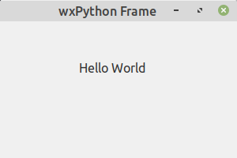

# wxPython_micro
Простейший пример оконной программы на wxPython c wxWidgets



```
#!/usr/bin/env python3
# coding=utf-8

import wx 
 
app = wx.App() 
window = wx.Frame(None, title = "wxPython Frame", size = (300,200)) 
panel = wx.Panel(window) 
label = wx.StaticText(panel, label = "Hello World", pos = (100,50)) 
window.Show(True) 
app.MainLoop()
```

## https://wxpython.org

Установка:
```
pip3 install -U wxPython
```

или так:
```
sudo apt-get install python-wxgtk3.0
```

---
### Как сделать портативную программу в виде одного исполняемого файла:
```
pip3 install pyinstaller
pyinstaller --onefile --windowed start.py
```
